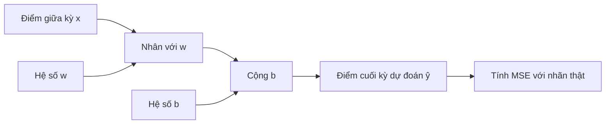

# Dự đoán điểm cuối kỳ từ điểm giữa kỳ

## Giới thiệu

Dự án này xây dựng một chương trình dự đoán điểm cuối kỳ của sinh viên dựa trên điểm giữa kỳ của cùng một học phần. Mô hình được cài đặt bằng PyTorch theo dạng hồi quy tuyến tính một biến, phù hợp cho bài toán dự báo đơn giản và dễ diễn giải.

Repository này gồm hai phần chính:

- `train.py`: huấn luyện mô hình trên dữ liệu trong `dataset/TRAIN2.xlsx`
- `main.py`: nạp mô hình đã huấn luyện và dự đoán điểm cuối kỳ khi nhập điểm giữa kỳ

## Mô hình dự báo

Mối quan hệ giữa điểm giữa kỳ $x$ và điểm cuối kỳ dự đoán $\hat{y}$ được mô tả bằng công thức:

$$
\hat{y} = wx + b
$$

Trong đó:

- $x$: điểm giữa kỳ
- $w$: hệ số góc của đường hồi quy
- $b$: hệ số chặn
- $\hat{y}$: điểm cuối kỳ dự đoán

Mô hình được tối ưu bằng Gradient Descent với hàm mất mát Mean Squared Error:

$$
L = \frac{1}{n} \sum_{i=1}^{n} (\hat{y}_i - y_i)^2
$$

Quá trình huấn luyện sử dụng cơ chế tính đạo hàm tự động của PyTorch để cập nhật tham số $w$ và $b$.

## Đồ thị tính toán

Đồ thị tính toán của mô hình có thể hiểu theo chuỗi sau:



Luồng này thể hiện phép nhân tuyến tính, cộng chệch và khâu đo sai số trước khi lan truyền ngược để cập nhật tham số.

## Cấu trúc thư mục

```text
.
├── dataset/
│   ├── TRAIN2.xlsx
│   └── Reference.ipynb
├── main.py
├── models/
│   └── model.pth
├── train.py
└── README.md
```

## Yêu cầu môi trường

- Python 3.10+ 
- `torch`
- `pandas`
- `openpyxl`

## Cài đặt

Nếu dùng môi trường ảo trong repo, kích hoạt trước rồi cài các gói cần thiết:

```powershell
.venv\Scripts\activate
pip install torch pandas openpyxl
```

## Cách chạy

### 1. Huấn luyện mô hình

```powershell
python train.py
```

Lệnh này sẽ đọc dữ liệu từ `dataset/TRAIN2.xlsx` và lưu checkpoint vào `models/model.pth`.

### 2. Dự đoán điểm cuối kỳ

```powershell
python main.py
```

Sau đó nhập điểm giữa kỳ trong khoảng từ 0 đến 10. Nhập `q` hoặc `exit` để thoát.

## Ghi chú

- `models/model.pth` là file trọng số sau huấn luyện.
- `Reference.ipynb` là notebook tham khảo phục vụ thuyết minh hoặc đối chiếu cách làm.
